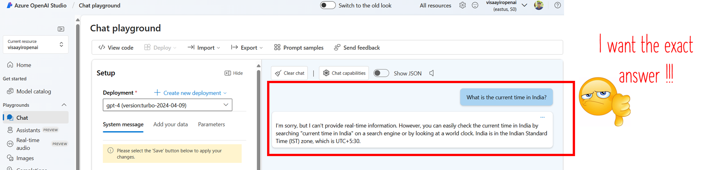
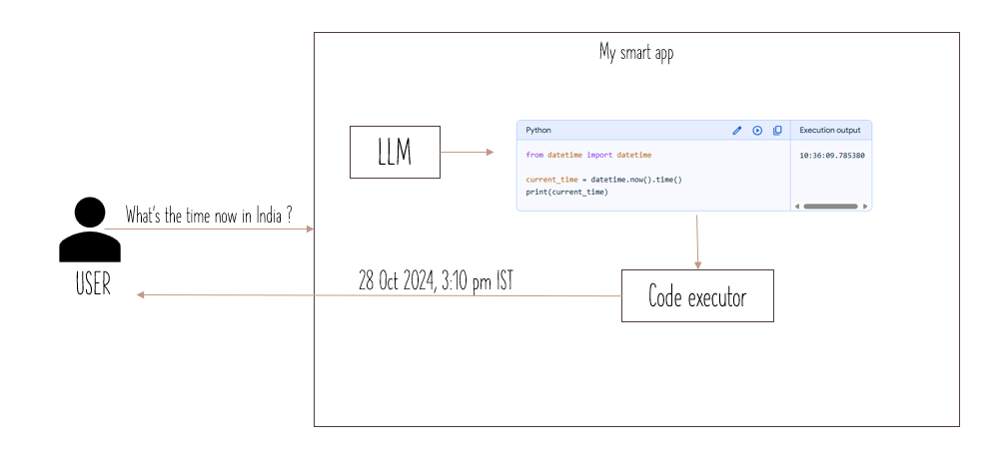

# Hands-on session : Build and deploy LLM powered app to Azure

In this hands on session, we will take up a problem, solve it using LLM and deploy the code to Azure Cloud.

## What shall we build today ?
Let's take this problem:

I ask LLM to tell me what's the current time.
LLM responds telling me that it doesn't have access to the right tools to provide me into information.

## Let's build a strategy:

Given a problem to the `Smart App` it uses LLM to figure out how to solve it.

For the above problem, LLM should generate a `python code` to find the current time.

The Smart App then has a code executor to run the python code and get the result.

## Lets's implement the strategy:
Navigate to [Workshop.md](workshop/Workshop.md) 